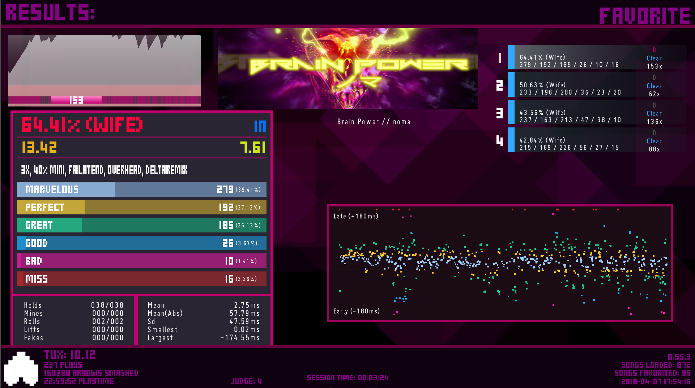

## Etternal Love: an Etterna theme inspired by SM5's "Simply Love" and based on 'Til Death 

### Transferring Player Preferences

To keep player preferences from another theme, its settings must be copied to the new theme.

In Linux for example, these settings can be found in  `../Etterna/Save/Til Death_settings/` (avatarConfig.lua, colorConfig.lua, themeConfig.lua) and can be copied to `../Etterna/Save/Etternal-Love_settings/`. 

Likewise, the contents of `../Etterna/Save/LocalProfiles/00000001/Til Death_settings/` (playerConfig.lua) can be copied to `../Etterna/Save/LocalProfiles/00000001/Etternal-Love_settings/`. 

### Screenshots (may be outdated)

 
 

### TODO:
* ~~add background animation~~
* add player color/visual options for background
* change colorconfig vspacing, add theme color options
* network compatibility
* ~~FIX BPM DISPLAY on Select Music Screen~~
* fix banner border on Select Music Screen
* ~~GET RID OF WEIRD WHITE QUAD in upper left corner of Screens (underlay?)~~
* more testing on non-widescreens
* ~~change gameplayscreen % location~~
