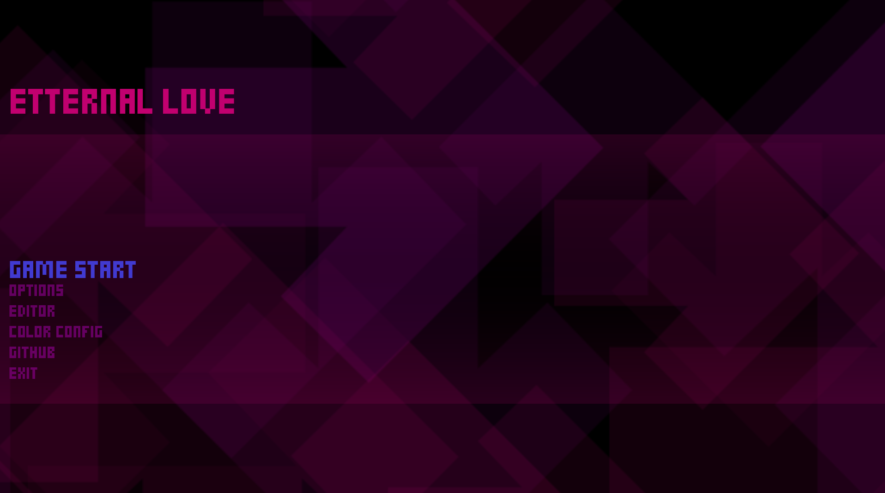
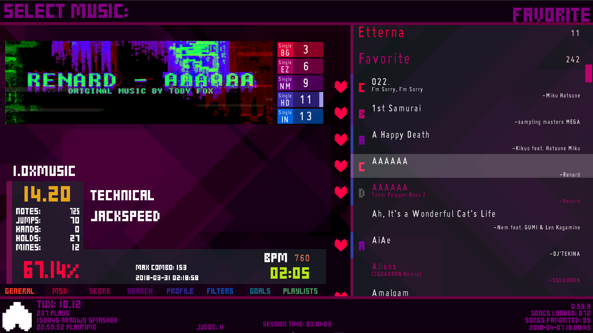

## Etternal Love: an Etterna theme inspired by the "Simply Love" Stepmania theme

### Transferring Player Preferences

To keep player player preferences from another theme, its settings must be copied to the new theme.

In Linux for example, these settings can be found in  `../Etterna/Save/Til Death_settings/` (avatarConfig.lua, colorConfig.lua, themeConfig.lua) and can be copied to `../Etterna/Save/Etternal-Love_settings/`. 

Likewise, the contents of `../Etterna/Save/LocalProfiles/00000001/Til Death_settings/` (playerConfig.lua) can be copied to `../Etterna/Save/LocalProfiles/00000001/Etternal-Love_settings/`. 

### TODO

* change gray quads on Select Music Screen
* add background animation to Title Screen
* add network compatibility
* FIX BPM
* get rid of weird white quad in upper left corner of selectMusicScreen

### Screenshots 

 
